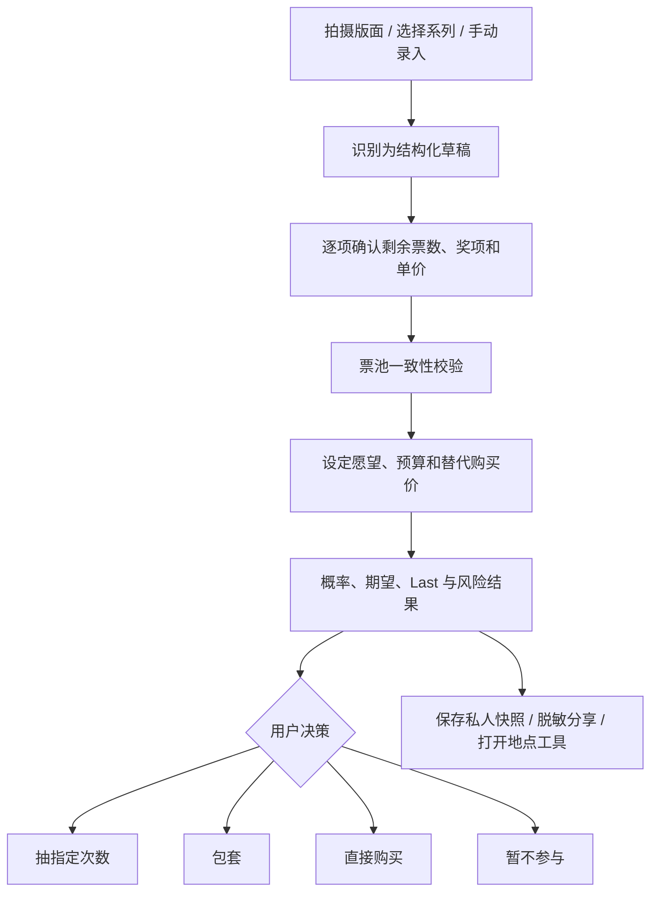
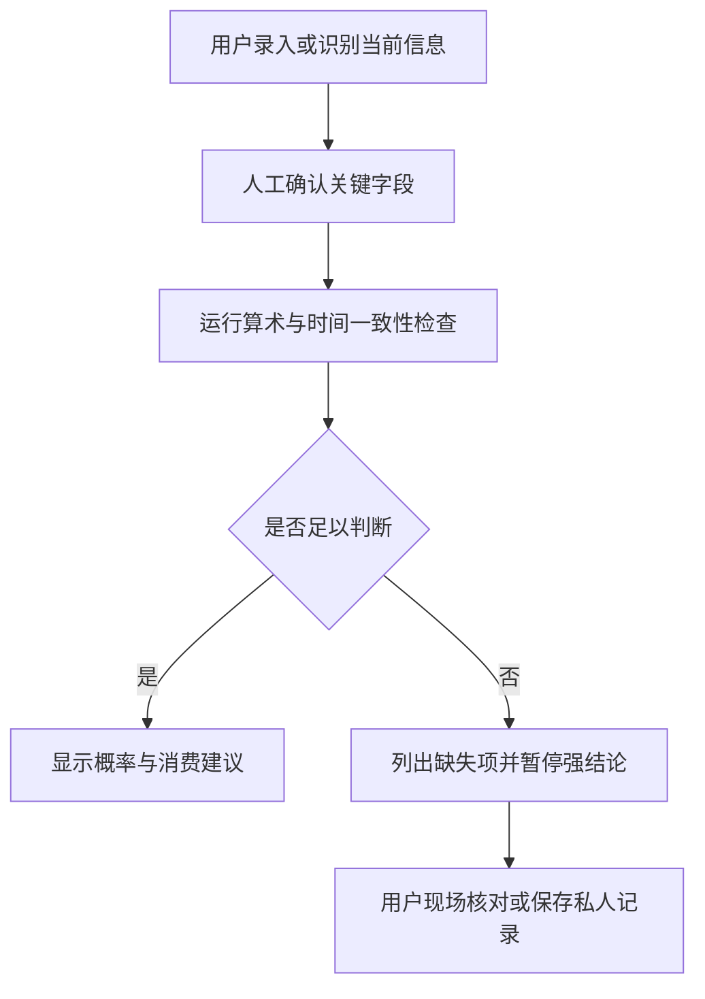

# ICHI 一番赏决策助手 PRD

> **文档角色：历史产品输入，不是当前正式 PRD。** 当前正式范围见根目录 `PRD.md` 与 `memory-bank/design-document.md`；本文件用于补充功能、风险和验收细节。

> 文档状态：Draft v0.2（用户侧边界版）  
> 更新日期：2026-08-01  
> 目标端：微信小程序 + 同功能 H5 网页  
> 产品类型：用户侧决策工具，不售卖奖票、不代抽、不处理抽赏付款、不接入商家经营系统

## 0. 文档定位

本文件是用于产品验证和原型设计的初版范围基线，不是最终商业方案、法律意见或上线许可。功能优先级、风险文案、图片识别方式和同步需求仍需通过用户测试确认。

本阶段冻结三项边界：

1. 产品只服务消费者个人决策，不建设商家侧产品。
2. 不依赖商家 API、库存系统、订单系统或商家合作才能运行。
3. 不建立公共店铺信用、举报、排名或反作弊裁决体系。

## 1. Executive Summary

- **产品不应只做概率计算器。** 用户真正缺少的是从“看懂当前票池”到“判断是否值得抽、是否值得包套”的完整个人决策链。ICHI 的核心定位是透明、可解释、可核对的一番赏决策助手，而不是店铺信用平台。
- **核心能力客户端优先，后端只做必要服务。** 手动录入、概率、愿望、Last、稀有度和风险自检必须离线可用；仅图片识别、可选跨端同步和模板更新使用 CloudBase 云函数。产品不依赖商家 API，也不建设商家后台。
- **“藏票预警”收紧为“当前输入完整性自检”。** 产品只判断用户录入的数据是否自洽，以及信息是否足够支持决策；不调查商家、不公开店铺风险分、不接受面向商家的举报和申诉。
- **商业目标不能建立在刺激用户多抽。** 推荐、成就和增长指标应奖励预算纪律、数据核对和理性停止，而不是抽数、消费额或连续购买。

## 2. 产品机会与调研结论

### 2.1 调研范围

本轮为定性桌面研究，覆盖 2015—2026 年公开可访问的中文论坛、日文媒体、消费者报道、官方信息页和已有计算工具。由于不同平台缺少统一搜索与互动数据，本 PRD 中的“高频”表示在本轮多个独立来源中重复出现，不代表严格的全网占比。

证据分为三档：

- A：官方页面、监管信息或媒体核实事件。
- B：有完整过程、图片或较多回复的用户案例。
- C：普通讨论、个人经验或搜索结果线索，仅用于发现需求。

### 2.2 高频讨论主题与产品含义

| 优先级 | 高频主题 | 代表性证据 | 产品含义 |
| --- | --- | --- | --- |
| P0 | 奖票数量、奖项进度表与实际票池不一致 | 经济参考报记者调查提到假票、藏票和线上概率操纵；日本官方店曾把旧票混入新池，使 80 张变为 112 张 | 必须记录票池总数、剩余数、奖项数、批次码和时间戳，并做一致性校验 |
| P0 | Last One 是否值得追、何时包套 | PTT、日文攻略与中文社区都围绕剩余票数、剩余大奖和全包成本讨论 | Last 推荐不能只看剩余张数，必须同时比较预算、愿望价值、剩余奖品和直接购买价 |
| P0 | 抽奖期望与直接购买哪个更划算 | 现有概率计算器有 4,309 次访问；V2EX 讨论明确提出“赔率不如直接买” | 结果页必须提供抽奖方案、包套方案和直接购买方案的并列比较 |
| P0 | 消费上头、未成年人和退款困难 | 青年报报道列出未成年人沉迷、攀比、退款难和奖品价值不符 | 加入预算上限、冷静提示、未成年人保护；禁止“再抽一次就回本”等文案 |
| P1 | 店铺是否正规、是否有货、信息是否新鲜 | 官方提供店铺搜索和部分官方店库存页，但也明确提示可能售罄或信息不一致 | 只提供官方公开入口、地图搜索和用户私人备注，不承诺当前库存或店铺可信度 |
| P1 | 商家“废套”压力与消费者透明诉求冲突 | 日本事件和国内报道都指出大奖先出后余票难卖，是违规操作的商业诱因之一 | 用于解释风险诱因和设计付款前核对清单，不延伸为商家合作或经营工具 |
| P1 | 线上不发货、退款和售后 | 投诉页与论坛热帖反复出现延迟发货、拒绝退款和客服失联 | 作为消费教育内容处理，不建立店铺履约评分或投诉平台 |
| P2 | 真假货、二级市场炒价与“稀有”概念混乱 | 社区常把箱内概率、市场缺货和二手高价统称为稀有 | 稀有度必须拆成箱内稀有、观察到的供应稀缺、价格稀缺三类 |

### 2.3 关键来源

- [经济参考报转载：小奖不断大奖难觅，抽奖游戏“一番赏”销售存猫腻](https://www.sohu.com/a/659984636_162758)：记者调查涉及假票、藏票、线上概率操纵、未成年人消费和商家废套动机。A 级。
- [关西电视台：日本一番赏官方店不正当销售事件](https://www.ktv.jp/news/feature/220902-1/)：旧池剩余 32 张混入新池，80 张变为 112 张，Last One 未按预期提供。A 级。
- [百度贴吧：包套前发现少票的用户案例](https://tieba.baidu.com/p/8091752511)：进度表显示 31 张，现场仅数出 27 张；页面显示 250 条回复。B 级。
- [青年报：年轻人参与一番赏与未成年人保护](http://www.why.com.cn/wx/article/2025/04/10/17442660201313330617.html)：报道消费沉迷、退款难和年龄核验责任。A 级。
- [台湾媒体：藏签投诉与联合稽查](https://tw.news.yahoo.com/%E7%95%AA%E8%B3%9E%E5%A4%9A%E6%AC%A1%E7%88%86-%E8%97%8F%E7%B1%A4-%E7%88%AD%E8%AD%B0-%E6%A5%AD%E8%80%85%E8%BA%B2%E7%A8%BD%E6%9F%A5%E6%89%8B%E6%B3%95%E6%9B%9D%E5%85%89-%E5%8C%97%E5%B8%82%E5%B0%87%E8%A9%95%E4%BC%B0%E8%A8%82%E8%87%AA%E6%B2%BB%E6%A2%9D%E4%BE%8B-045500036.html)：报道台北近三年 16 件消费申诉和 12 场联合稽查。A 级。
- [V2EX：一番赏概率计算器讨论](https://www.v2ex.com/t/837659)：页面显示 3,626 次点击、15 条回复，讨论概率、娱乐价值和操作空间。B 级。
- [PTT：为 Last One 包套是否值得](https://www.ptt.cc/bbs/ONE_PIECE/M.1442763588.A.DD5.html)：用户分享剩余 12—15 张时全包、直接购买等决策。C 级。
- [Lei Mao 一番赏概率计算器](https://leimao.github.io/essay/%E4%B8%80%E7%95%AA%E8%B5%8F%E6%A6%82%E7%8E%87%E8%AE%A1%E7%AE%97%E5%99%A8/)：已有工具支持剩余奖项、目标、估值和不同抽数的完成概率，页面显示 4,309 次访问。B 级。
- [BANDAI SPIRITS 官方产品列表](https://1kuji.com/products)与[官方店铺搜索](https://1kuji.com/shop_lists)：可作为系列、发售与店铺候选数据源，但官方也提示门店可能售罄、信息可能与现场不同。A 级。
- [一番赏官方店库存信息](https://bandainamco-am.co.jp/chara_shop/ichibankuji-official-shop/NEWS/all/stock/)：证明部分官方店存在可查询的在售商品页，但并非所有门店都有实时余票。A 级。

## 3. 产品定义

### 3.1 一句话定位

ICHI 帮助玩家识别一番赏版面、设定愿望与预算、计算真实的不放回概率、评估 Last One，并在付款前完成个人信息核对与风险自检。

### 3.2 产品边界

ICHI 做：

- 计算、记录、解释和比较。
- 辅助识别奖项版面与剩余票池。
- 展示票池信息完整性和证据状态。
- 提供官方公开店铺入口、地图搜索和用户自己的购买地点备注。
- 帮助用户整理证据和核对问题，但不代替投诉、鉴定、执法或法律判断。

ICHI 不做：

- 不在线售票、代抽、直播抽赏或托管抽奖资金。
- 不提供“必中”“回本”“稳赚”等承诺。
- 不公开店铺风险分、黑名单、投诉排行或用户对商家的指控。
- 不建设商家账号、商家后台、认领、申诉、库存同步或商家 API 接入。
- 不把用户私人记录聚合成面向公众的店铺评价。
- 不把未经授权抓取的二手价格当成官方市场价。
- 不鼓励用户为了成就、排名或连续签到增加消费。

### 3.3 核心产品原则

1. 先核对数据，再给结论。
2. 公式、输入和假设对用户可见。
3. 风险提示描述“发现了什么”，不推断“商家主观上做了什么”。
4. 店铺相关信息仅用于用户私人决策，不形成公共声誉系统。
5. 数据不足时输出“不足以判断”，而不是生成虚假的精确分数。
6. 任何消费建议都提供预算和直接购买替代方案。
7. 核心计算不依赖登录、网络、商家接口或平台审核。

### 3.4 风险边界总表

| 边界 | ICHI 可以做 | ICHI 不能做 | 越界时的产品行为 |
| --- | --- | --- | --- |
| 数据边界 | 检查用户确认后的票数、奖项、价格、时间是否自洽 | 把 OCR、截图或旧网页自动视为现场事实 | 标记来源和置信度，要求人工确认 |
| 算法边界 | 计算固定票池、不放回抽取的概率与成本 | 预测商家行为、其他顾客行为、后台控奖或未来库存 | 输出“模型不适用/无法判断” |
| 风险边界 | 指出当前输入缺失或相互矛盾 | 判断藏票、混票、诈骗、违法或责任主体 | 停止强推荐，只给现场核对清单 |
| 店铺边界 | 打开官方公开目录、地图候选和用户私人备注 | 提供实时库存、店铺认证、信用分、排名或公共评价 | 显示来源与过期提示，不展示可信标签 |
| 分享边界 | 导出脱敏计算图或用户主动选择的私人证据包 | 默认公开店名、精确位置、个人信息或主观指控 | 普通分享强制脱敏；敏感导出二次确认 |
| 法律边界 | 提供通用消费记录清单和官方维权渠道链接 | 提供法律定性、证据鉴定、退款概率或代理投诉 | 固定免责声明，并建议咨询有资质机构 |
| 技术边界 | 使用云函数做识别、可选同步和模板更新 | 依赖商家 API、POS、订单、库存或经营后台 | 降级为手动录入和公开链接 |
| 商业边界 | 通过高级个人工具或非刺激性订阅探索收入 | 向商家售卖排名、线索或风险豁免 | 不采集商家线索，不提供付费置顶 |

## 4. 用户与任务

### 4.1 玩家类型

| 用户 | 主要任务 | 最大痛点 |
| --- | --- | --- |
| 新手玩家 | 看懂规则，避免盲抽 | 不知道总票数、奖项表、Last One 和剩余概率如何关联 |
| 目标型收藏者 | 获得指定 A/B/Last 奖 | 容易只看大奖还在，却忽略成本和多个目标之间的概率 |
| Last 猎手 | 找适合包套的残局 | 无法快速比较剩余总价、剩余奖品价值和直接购入价 |
| 风险敏感玩家 | 判断当前票池是否完整 | 现场信息分散，发现异常后缺少结构化证据 |
| 记录型玩家 | 保存不同地点和时间的票池 | 截图、价格、奖项和个人判断散落在相册与聊天记录中 |

### 4.2 Jobs to Be Done

- 当我站在店铺奖项板前，我想在一分钟内录入当前票池，知道信息是否自洽。
- 当我只想要某几个奖品时，我想知道抽 1、3、5、10 次的成功率和期望成本。
- 当剩余票数不多时，我想知道包套拿 Last One 是否比直接购买更合理。
- 当票数或版面异常时，我想保留带时间、地点和来源的证据，并得到不夸大的风险提示。
- 当我寻找购买地点时，我想快速打开官方店铺列表或地图，并保留自己的私人备注，但不希望看到未经核实的店铺排名。

## 5. 架构决策：客户端优先 + 必要云函数

### 5.1 为什么采用客户端优先而非重后端

核心用户价值可以纯前端完成：

- 手动录入与版面校验。
- 不放回概率、期望成本和 Last One 计算。
- 愿望、预算、私人地点备注、历史和本地成就。
- 本地导出与脱敏分享图。

但以下能力不适合把密钥或模型直接放进客户端，因此使用极薄的云函数：

- OCR/多模态版面识别。
- 可选的 H5 与微信小程序数据同步。
- 官方系列模板的版本更新。
- 可选的短期分享链接；默认仍优先生成本地图片。

后端不可用时，用户仍能通过手动录入完成全部核心决策。首版不建设店铺数据库、公共票池库、举报审核系统或商家接口。

### 5.2 推荐技术架构

| 层 | 方案 | 职责 |
| --- | --- | --- |
| 跨端前端 | Taro + React + TypeScript | 一套业务代码输出微信小程序和 H5 |
| 计算内核 | 独立 TypeScript package | 不放回概率、期望、预算、Last 方案、输入校验；两端共享 |
| 本地数据 | 小程序 Storage + H5 IndexedDB | 草稿、历史、愿望、私人地点备注和成就 |
| 可选后端 | 腾讯云 CloudBase | 识别代理、可选同步、模板更新和短期分享 |
| 视觉识别 | 服务端 OCR + 多模态视觉接口 | 版面字段提取，只生成待确认草稿 |
| 地点辅助 | 官方公开链接 + 系统地图能力 | 打开候选购买地点；不读取商家库存系统 |

### 5.3 客户端与服务端边界

客户端负责：

- 所有确定性数学计算和可视化。
- 离线手动录入、草稿保存、本地历史和私人地点备注。
- 图片裁切、压缩、敏感区域预览。
- 明示用户正在使用的公式、数据时间和数据来源。
- 所有风险自检；服务端不生成商家风险结论。

可选服务端只负责：

- 图片识别任务和短期文件生命周期。
- 用户主动开启后的加密同步与设备迁移。
- 系列模板版本分发。
- 短期分享链接的生成和失效。

服务端明确不负责：

- 商家库存、订单、价格或营业状态接入。
- 店铺认证、风险评分、举报、申诉和仲裁。
- 代表用户联系商家或发送投诉。
- 根据群体数据推断某家店是否作弊。

## 6. 信息架构

### 6.1 一级导航

1. 首页：扫码分析、手动计算、最近票池。
2. 工具：系列模板、官方店铺入口、地图搜索和规则说明。
3. 记录：计算、票池快照、愿望和收藏。
4. 我的：预算、成就、私人地点备注、同步和隐私。

### 6.2 核心玩家流程

### 6.3 风险自检流程

## 7. 功能需求

### 7.1 一番赏期望工具

#### 目标

把“我抽几次合适”从直觉问题变为可解释的概率与成本比较。

#### 输入

- 票池模式：全新池、当前剩余池。
- 总票数 `R`、单抽价格 `c`。
- 每个奖项的初始数量、剩余数量、名称和图片。
- 用户目标：任意一个目标、指定数量、多个奖项同时达成。
- 可选个人估值 `v_i`，不是系统宣称的市场价。
- 抽数候选：1、3、5、10、自定义、包套。
- 预算上限和直接购买参考价。

#### 输出

- 下一抽命中任意目标的概率。
- 抽 `k` 次至少命中一个目标的概率。
- 达成多目标愿望的概率。
- 首次命中目标的期望抽数与 P50/P80/P90 抽数。
- 抽 `k` 次的期望个人价值、成本和差额。
- 包套总成本、确定获得的剩余奖品与 Last One。
- 与直接购买相比的成本差。
- 数据完整性和结论可信度。

#### 公式与规则

当剩余 `R` 张、目标票共 `M` 张时：

- 下一抽命中率：`M / R`。
- 抽 `k` 次至少命中一个：`1 - C(R-M, k) / C(R, k)`。
- 抽 `k` 次目标奖期望数量：`k × M / R`。
- 首次命中任一目标的期望抽数：`(R + 1) / (M + 1)`。
- 最坏情况下首次命中任一目标：`R - M + 1`。
- 包套成本：`R × c`。
- 包套个人净值：`Σ(n_i × v_i) + v_last - R × c`。

多个奖项都需达成时，计算内核使用多元超几何分布或动态规划，不用各奖项概率简单相乘。

#### 产品约束

- 概率只在输入自洽时显示为“已验证结果”。
- 没有个人估值时，不显示“回本率”，只显示概率和现金成本。
- 市场参考价必须带来源、抓取/录入时间和价格区间。
- 结果默认提供“停止/直接购买”方案，不只提供更多抽数。

### 7.2 版面分析

#### 目标

把奖项海报、兑换进度表和余票信息转换为可核对的结构化票池。

#### 支持输入

- 现场拍照。
- 相册图片、用户保存的网页截图或聊天图片。
- 官方产品页链接或系列模板。
- 手动创建空白版面。

#### 识别字段

- 系列名、IP、发售批次和官方链接。
- A—N 等奖项、Last One、奖品名称与图片区域。
- 初始数量、已抽数量、剩余数量。
- 单抽价格、币种、购买限制。
- 可选的地点别名、拍摄时间和地理位置；这些字段默认只保存在用户设备或私人同步空间。
- 票盒/票面批次码，仅保存必要的脱敏片段。

#### 交互

1. 用户拍摄后先裁切“奖项板”“兑换进度表”“票盒”三个区域。
2. 服务端返回结构化草稿，每个字段附置信度和原图定位框。
3. 低置信字段高亮，禁止一键跳过确认。
4. 用户确认或修正后再运行一致性校验。
5. 快照默认私人保存；首版不存在店铺或社区公开数据池。

#### 一致性校验

- 剩余各奖项数量之和必须等于剩余票数。
- 初始数量、已抽数量和剩余数量必须守恒。
- Last One 不计入普通票数，但必须标明是否仍存在。
- 用户标记为同一票池的连续快照，剩余数原则上只能下降；若增加，要求用户确认是否为新池、补录错误或无法判断。
- 批次码、系列和奖项模板不匹配时提示复核。
- 图片时间过旧时不作为当前现场决策依据。

#### 验收

- 用户必须能完全不用 AI、通过手动方式完成同一流程。
- OCR 错误不会直接生成风险结论。
- 保存前显示结构化数据与原图的并排核对页。

### 7.3 愿望设定

#### 愿望模型

每个奖品可设为：

- 必须获得。
- 想要。
- 有也可以。
- 不想要。

用户同时设置：

- 单次决策预算和月度娱乐预算。
- 最大可接受抽数。
- 风险偏好：保守、平衡、体验优先。
- 是否接受重复奖品。
- 是否追求 Last One。
- 直接购买参考价和愿意支付的最高价。
- 停止条件，例如“花到 300 元仍未命中即停止”。

#### 输出联动

- 期望工具根据愿望权重计算个人价值，而不是通用“奖品价值”。
- 地点工具可按用户私人记录提示“上次在此见过该系列”，但必须显示记录时间且不得写成当前有货。
- 成就只奖励遵守预算和完成计划，不奖励多抽。

### 7.4 当前输入完整性自检（原“藏票预警”）

#### 产品风险边界

该能力是个人决策前的输入检查器，不是反作弊检测器。它回答：

- 当前录入的数字能否互相对上？
- 当前图片和字段是否足以计算？
- 哪些信息仍需用户在付款前现场确认？
- 哪些异常可以被保存为个人记录？

它不回答：

- 商家是否主观藏票、混票、诈骗或违法。
- 某张票是否被人为抽走。
- 某次不中是否由后台控奖造成。
- 某家店是否可信、是否值得公开曝光。
- 用户能否因此获得退款、赔偿或行政处理。

任何结论只对“这一次用户输入的票池快照”有效，不能外推到店铺、品牌、其他时间或其他票池。

#### 命名原则

界面不使用“该店藏票”“作弊概率 80%”“黑店”等表述。统一使用：

- 数据可计算。
- 信息不足，无法判断。
- 输入之间存在矛盾。
- 这是随机结果，不能据此推断异常。
- 已保存为私人观察记录。

#### 风险信号

硬性不一致：

- 版面剩余数与现场可数票数不一致。
- 剩余奖项数量之和与余票数不一致。
- 用户标记为同一池的后续记录出现余票增加，且尚未确认是否换池。
- 奖项板显示奖品仍在，包套后实际不存在。
- 同一次记录中的系列、票面或批次标识彼此不一致。

信息质量风险：

- 版面没有更新时间或更新时间过旧。
- 只展示大奖，未展示完整奖项与余票。
- 图片经过明显裁切，无法看到关键区域。
- 用户无法在付款前核对剩余票数。
- 单价、购买限制或 Last One 状态不明确。

非风险或弱信号：

- 多次未中大奖本身不是藏票证据。
- 大奖集中在后段在随机不放回模型中可能自然发生。
- 二手价格高、商家限购或用户主观感觉不能单独证明票池不完整。

#### 风险分层

| 等级 | 条件 | 用户文案 | 可执行动作 |
| --- | --- | --- | --- |
| 可计算 | 核心字段完整且守恒 | 当前输入可以用于数学计算，但不代表现场票池已被平台验证 | 继续计算；付款前再次核对 |
| 信息不足 | 字段缺失、图片过期或只有弱信号 | 信息不足，无法可靠判断 | 补拍、询问现场、暂缓包套 |
| 存在矛盾 | 出现一项或多项算术/标识矛盾 | 当前输入存在矛盾，计算结果可能失真 | 不给强推荐；修正输入或停止购买 |

#### 私人记录与安全分享

- 记录可包含系列、时间、可选地点别名、原图和用户备注，默认只对用户本人可见。
- 产品不提供“举报商家”按钮，不把私人记录发送给商家或平台运营人员。
- 导出证据包时自动遮挡人脸、电话、订单号和无关顾客信息，并提醒用户再次检查。
- 普通分享图默认移除店名、精确位置、票面编号和“疑似作弊”等主观结论，只展示计算输入与自检状态。
- 如果用户需要维权，产品仅提供“导出个人记录”和官方消费者渠道说明，不判断责任、不代发投诉、不承诺处理结果。
- 用户修改输入后保留本地版本历史，便于说明“原始识别值”和“人工修正值”，但该历史不是司法鉴定。

#### 五类明确禁止的输出

1. 不输出商家作弊概率或信用分。
2. 不输出面向公众的店铺黑名单、红黑榜或风险地图。
3. 不把概率较低但可能发生的开奖结果标成异常。
4. 不根据其他用户数据向当前用户暗示某店存在违法行为。
5. 不提供法律定性、证据效力或退款成功率预测。

### 7.5 Last One 推荐度

#### 核心判断

Last One 推荐不是“剩 10 张就值得”。它由以下可解释因素组成：

- 清池总成本。
- Last One 的个人价值。
- 其他剩余奖品的个人价值。
- 必须获得奖品的确定性。
- 用户预算占用比例。
- 直接购买 Last One 与目标奖品的参考价。
- 票池完整性与信息新鲜度。
- 门店购买限制和是否允许一次买完。

#### 推荐等级

- 推荐包套：数据完整、清池不超预算，且个人总价值明显高于清池成本或能确定完成强愿望。
- 可以考虑：差额接近、主要购买娱乐体验，用户需确认可接受成本。
- 不建议：超预算、直接购买更便宜、剩余奖品与愿望匹配弱。
- 无法判断：余票、奖项、价格或 Last 状态缺失。

#### 重要约束

- 当用户只买 `k < R` 张时，系统不虚构“获得 Last 的概率”。在没有其他顾客行为模型时，这一概率不可可靠计算。
- 只有承诺购买全部剩余票且门店允许时，Last One 才作为确定获得项。
- 推荐结果必须列出组成项，不提供神秘总分。

### 7.6 稀有程度

#### 三层稀有度

1. 箱内稀有度：该奖项初始/剩余数量相对于票池数量。
2. 官方发行状态：依据公开系列资料标记预售、在售、已结束或未知；不代表具体店铺库存。
3. 个人观察稀缺：用户可根据自己的私人记录标记“常见/少见/未知”，不聚合为全网结论。

市场稀缺只有在未来获得合法、稳定且可审计的数据源后才评估；不属于当前规划。

#### 展示规范

- “1/80”比“SSR”优先，先展示事实再展示标签。
- “稀有”不等于“值钱”，两者分开展示。
- 没有官方发行信息时显示“未知”，不从搜索热度推断稀有度。
- 官方未公布总发行量时，不得声称“全球限量”。
- 用户私人判断与官方资料明确区分。

### 7.7 关联购买地点辅助

#### 推荐目标

帮助用户从系列或愿望快速打开可能的购买地点和自己保存过的地点。该能力不是库存推荐、店铺评分或可信度排名。

#### 数据来源

- 品牌方公开的店铺搜索页和产品页链接。
- 系统地图或合规地图服务返回的公开 POI。
- 用户本人保存的地点、时间、照片和私人备注。
- 用户手动粘贴的网页链接。

#### 排序因子

- 官方公开页面是否列为该系列的销售候选地点。
- 与当前位置的距离；只有用户授权后计算。
- 用户本人最近一次记录时间。
- 用户私人收藏和备注标签。
- 地图服务提供的公开营业信息；必须标明来自地图服务，ICHI 不保证准确。

#### 明确不做

- 不请求商家接入 API，不读取 POS、库存、订单或会员系统。
- 不创建商家账号、认领入口、商家后台或付费推广。
- 不展示“目标奖仍在”“当前余票”“平台已验证”等需要实时商家数据才能成立的结论。
- 不建立公共评分、评论、举报、黑名单或风险排序。
- 不向商家发送用户愿望、浏览、位置或风险记录。

#### 边界

- “官方店铺列表中存在”不等于“当前有货”。
- 用户私人记录只表达“我在某时记录过”，不等于当前状态。
- 地图 POI 只用于导航候选，不代表正规授权、在售或可信。
- 如果无法获得合规地图能力，首版退化为官方页面跳转和用户手动收藏，不影响核心功能。

### 7.8 成就系统

#### 设计原则

成就用于培养理性决策和个人记录质量，不用于刺激抽奖或社区竞争。

#### 首版成就

- 第一次完成完整票池计算。
- 预算守门员：三次记录都遵守预设预算。
- 认真核对：修正过低置信 OCR 字段并通过一致性校验。
- 来源记录者：连续三次记录都填写了数据来源和时间。
- 愿望达成：以任意方式完成一个愿望，包括直接购买。
- 理性止损：按预设停止条件结束一次记录。
- 冷静观察员：发现信息不足后选择“暂不判断”。
- 数据整理者：导出或迁移自己的记录并通过完整性校验。

#### 禁止成就

- 累计抽 100 次。
- 连续消费 7 天。
- 单次消费破千。
- “差一点回本，再来一次”。

## 8. 页面规格

### 8.1 首页

- 主操作：拍照分析。
- 次操作：手动创建、从系列模板开始。
- 愿望、最近记录和官方系列快捷入口。
- 最近计算与预算状态。
- 不展示“今日欧气”“大家正在疯抢”等刺激文案。

### 8.2 识别确认页

- 左侧/上方原图，右侧/下方结构化字段。
- 每个字段可点击定位原图区域。
- 红色只表示数据错误，不表示商家违规。
- 明确的“尚未确认，仅私人保存”状态。

### 8.3 结果页

首屏按顺序显示：

1. 建议：抽几次、包套、直接购买或暂不参与。
2. 数据可信状态与时间。
3. 成本和预算占用。
4. 成功概率与期望抽数。
5. Last One 方案。
6. 风险提示与核对建议。
7. 详细公式、假设和输入。

### 8.4 购买地点辅助页

- 官方公开店铺搜索入口和来源说明。
- 地图候选地点；不显示 ICHI 可信度或库存标签。
- 用户自己的到访时间、照片和私人备注。
- “公开来源可能过期，请出发前自行确认”的固定提示。
- 导航、电话和定位必须由用户主动触发。
- 不展示其他用户记录，不提供公共评价区。

### 8.5 我的

- 本月预算与已记录支出。
- 愿望清单。
- 计算和票池快照。
- 成就与私人地点记录。
- 数据导出、图片删除、账号注销。
- 可选同步开关与云端数据清理。

## 9. 数据模型

### 9.1 核心实体

| 实体 | 默认位置 | 关键字段 |
| --- | --- | --- |
| UserPreferences | 本地；可选私人同步 | 年龄段声明、地区、预算、隐私设置 |
| SeriesTemplate | 应用内置/模板服务 | 官方名称、IP、发售日、官方 URL、初始奖项模板、来源版本 |
| Prize | 模板或本地 | series_id、等级、名称、初始数量、图片、来源 |
| PoolSnapshot | 本地；可选私人同步 | 剩余票数、奖项剩余、时间、来源、自检状态 |
| EvidenceAsset | 本地或短期私有云存储 | 图片、哈希、脱敏状态、删除时间 |
| Wish | 本地；可选私人同步 | prize_id、优先级、数量、最高直接购买价 |
| Calculation | 本地；可选私人同步 | 输入快照、公式版本、输出、预算、用户决策 |
| RiskCheck | 本地；可选私人同步 | 快照、矛盾类型、缺失字段、用户备注 |
| PlaceNote | 本地；可选私人同步 | 地点别名、坐标、来源链接、到访时间、私人备注 |
| Achievement | 本地；同步后可复算 | 规则版本、授予原因、撤销状态 |

### 9.2 数据不变性

- 私人票池使用追加式快照，不原地覆盖历史；用户可删除整个记录链。
- 计算结果保存公式版本，算法升级不改写历史结论。
- OCR 原始值与用户修正值分开保存，避免误把识别结果当成人工确认事实。
- 用户关闭同步或注销后，云端副本按删除策略清除；本地数据由用户选择保留或删除。

## 10. 必要服务 API 草案

| 方法 | 路径 | 用途 |
| --- | --- | --- |
| POST | `/v1/vision/board-analysis` | 上传版面并创建识别任务 |
| GET | `/v1/vision/jobs/:id` | 获取识别草稿与字段置信度 |
| GET | `/v1/series` | 搜索系列和官方模板 |
| GET | `/v1/series/:id/version` | 检查模板版本与来源更新 |
| POST | `/v1/sync/batch` | 用户主动开启后的私人数据增量同步 |
| GET | `/v1/sync/changes` | 获取用户自己的跨端变更 |
| POST | `/v1/share` | 可选创建已脱敏、短期有效的只读分享 |
| DELETE | `/v1/share/:id` | 用户主动撤销分享 |
| DELETE | `/v1/users/me` | 注销并执行数据删除流程 |

不存在商家、店铺库存、公开举报或风险评分 API。所有写接口只处理当前用户私有数据，需要幂等键、权限隔离、速率限制和删除审计。

## 11. 信任、隐私与合规

### 11.1 隐私

- 拍照页提示不要拍摄无关顾客、人脸、支付信息和完整手机号。
- 客户端优先做人脸和文本敏感区域预检测。
- 原图默认本地保存；发送识别服务前明确提示并征得同意。
- 云端识别原图默认在任务完成后短期删除，最长不超过 30 天；用户可立即删除。
- 地理位置只用于用户自己的地点记录和导航，不形成公共轨迹或店铺画像。
- 私人同步默认关闭；开启前展示同步范围、删除方式和跨端风险。

### 11.2 未成年人保护

- 不提供抽赏购买入口或支付跳转。
- 首次使用预算功能时提供年龄和监护提示。
- 未成年人模式隐藏二手价格炒作内容，默认更低预算提醒频率。
- 分享图不使用“上头”“搏一搏”“翻本”等诱导措辞。

### 11.3 名誉与外部争议边界

- 产品没有公共举报、店铺评论、风险榜、风险地图或商家档案。
- 自检结果只描述用户输入，不命名责任方，不对店铺作事实认定。
- 普通分享默认删除店铺身份和精确位置，避免私人怀疑被产品包装为公开结论。
- 用户自行把私人记录发布到外部平台时，ICHI 不为其主观指控背书；分享页需明确提醒核实事实和保护他人隐私。
- “证据包”只是信息整理，不代表材料真实、完整、合法取得或具有法律效力。
- 产品可链接消费者保护机构的公开说明，但不提供个案法律意见。

### 11.4 品牌与数据使用

- 官方系列图片与文本按授权和引用范围使用。
- 不暗示 ICHI 是 BANDAI SPIRITS 官方产品。
- 官方系列和店铺入口只做链接或经许可的模板，不绕过网站限制批量抓取。
- 市场价格只接入有授权或公开许可的数据源。

## 12. 非功能需求

| 类别 | 目标 |
| --- | --- |
| 计算性能 | 典型票池本地计算 P95 小于 100 ms |
| 识别性能 | 图片上传后 10 秒内返回初稿；超时提供后台通知和手动入口 |
| 可用性 | 核心手动计算离线可用；服务端月可用性目标 99.9% |
| 准确性 | 所有概率引擎由枚举小样本、蒙特卡洛和公式三路测试 |
| 跨端 | 同一测试向量在 H5 和小程序结果完全一致 |
| 无障碍 | H5 目标 WCAG 2.2 AA；颜色不是唯一风险表达 |
| 安全 | 文件白名单、病毒扫描、签名 URL、权限隔离、速率限制 |
| 可观测 | 识别失败、计算错误、同步冲突和数据删除失败均有告警 |

## 13. 指标体系

### 13.1 北极星指标

**有效决策完成数**：用户完成“已确认票池 + 愿望/预算 + 可解释结果”，并选择抽取、包套、直接购买或暂不参与之一。

该指标不要求用户消费，选择“暂不参与”同样算有效决策。

### 13.2 核心指标

- 版面分析完成率。
- OCR 字段一次确认率和人工修正率。
- 计算结果查看到决策选择转化率。
- 愿望设置后完成一次对比决策的比例。
- 自检发现信息不足后完成补录或选择暂不参与的比例。
- 私人记录的数据来源和时间填写率。
- 预算设置率与预算遵守率。
- H5 与小程序跨端同步成功率。

### 13.3 护栏指标

- 单次会话连续计算次数异常增长。
- 未成年人相关投诉数。
- 普通分享中意外包含店名、精确位置或个人信息的反馈数。
- 用户误以为自检结果代表平台鉴定的反馈数。
- 用户因“推荐”超预算的反馈数。
- 原图超期未删除数量。

## 14. 版本规划

### 14.1 MVP：闭环验证

必须覆盖八个方向的最小完整版本：

- 手动期望计算与不放回概率。
- 图片识别草稿 + 人工确认。
- 愿望、预算和停止条件。
- 单次快照的票池完整性校验。
- 可解释 Last One 推荐。
- 箱内稀有度。
- 官方店铺入口、地图打开能力和用户私人地点备注。
- 理性消费与个人记录类成就。
- CloudBase 图片识别代理；同步可在 MVP 后半段按需开启。

MVP 不做二手成交价自动抓取，不做公开黑名单、店铺评价、公共举报、商家后台或在线抽奖。

### 14.2 V1：个人数据与跨端体验

- 可选账号和加密同步。
- 同一用户的连续票池快照与变更历史。
- 私人地点收藏、地图跳转和到访记录。
- 脱敏证据包与可撤销的短期分享。
- H5 分享落地页和小程序回流。

### 14.3 V2：数据深度

- 获得授权后的市场价格与供应数据。
- 多地区官方数据源适配。
- 更强的本地图片脱敏和跨私人快照矛盾识别。
- 用户自主导入、导出和备份格式。

即使进入 V2，也不默认扩展到商家 API、公共店铺风险评分或举报平台；任何此类方向都需要新的独立 PRD 与合规评估。

## 15. MVP 验收标准

### 15.1 计算

- 对 `R=80, M=2` 的任意抽数，结果与组合数公式一致。
- `k=0` 概率为 0，`k=R` 且 `M>0` 概率为 1。
- 输入剩余奖项总数不等于 `R` 时阻止“已验证”结果。
- 同一 JSON 输入在 H5 和小程序输出一致。

### 15.2 版面分析

- 至少支持一张奖项板和一张进度表组合识别。
- 每个识别字段可查看来源框和置信度。
- 用户可手动新增、删除、修改任意奖项。
- 未确认识别结果不能进入正式计算或分享。

### 15.3 愿望与 Last

- 用户可设置多个必须获得目标和不同数量。
- 超出预算时 Last 推荐必须为“不建议”或“无法判断”。
- `k<R` 时不显示伪造的 Last 概率。
- 直接购买更便宜时结果首屏明确提示。

### 15.4 风险提示

- 31 张版面、27 张现场票的案例必须触发“当前输入存在矛盾”。
- 40 抽不中但票数守恒的案例不得单独触发藏票结论。
- 自检结果不得生成店铺风险分、举报入口或公开店铺状态。
- 普通分享必须默认删除店名、精确位置、票面编号和主观指控。

### 15.5 地点辅助与成就

- 官方店铺入口必须显示来源，并提示不代表当前有货。
- 私人地点记录只对当前用户可见，不能出现在其他用户页面。
- 没有商家 API 时产品功能仍完整，不出现空白“实时库存”模块。
- 成就规则中没有抽数、连续购买或消费额奖励。
- 地点候选若排序，理由只能来自距离、官方目录匹配和用户私人收藏。

## 16. 主要风险与对策

| 风险 | 影响 | 对策 |
| --- | --- | --- |
| OCR 错误被用户当成事实 | 错误计算或外部争议 | 强制人工确认；保留识别值与修正值；未确认不得分享 |
| 自检被误解为作弊鉴定 | 伤害第三方名誉并增加法律风险 | 只描述输入矛盾；无风险分、无黑名单、无举报按钮 |
| 用户外部分享私人怀疑 | 店铺身份和个人信息泄露 | 普通分享默认脱敏；证据包二次确认；固定边界提示 |
| 官方或地图信息过时 | 用户误以为当前有货 | 明示来源和时间；从不显示平台保证的实时库存 |
| 价格数据不可靠 | 错误“回本”建议 | MVP 使用用户个人估值；市场价必须有授权来源和区间 |
| 产品反向刺激消费 | 社会和合规风险 | 北极星不绑定消费；预算优先；禁止消费型成就 |
| 官方数据使用受限 | 系列与地点覆盖不足 | 以内置模板、官方链接和用户手动录入起步，不依赖抓取 |
| 云端服务不可用 | OCR、同步受影响 | 核心手动流程完全离线可用，明确降级入口 |

## 17. 待验证问题

这些问题不阻塞原型，但必须在 MVP 用户测试中回答：

1. 现场用户愿意拍几张图，最长可接受的确认时间是多少？
2. “版面分析”主要面对官方纸质进度表、手写标记板，还是线上截图？
3. 用户更理解“个人估值”还是“我最高愿意花多少钱”？
4. 用户是否真的需要跨端同步，还是本地导出/导入已足够？
5. 地点辅助使用官方目录跳转是否足够，是否值得承担地图 POI 的成本与隐私复杂度？
6. 首发地区是中国大陆、日本，还是同时支持；这会决定地图、官方资料和合规提示。
7. “私人证据包”是否属于首版刚需，还是应先只提供安全分享图？

## 18. 下一步执行顺序

1. 用本 PRD 完成核心术语和边界评审。
2. 为“扫码分析—确认—愿望—结果”制作 Figma 低保真主流程。
3. 先实现独立 TypeScript 计算内核和固定测试向量。
4. 完成本地数据层；随后只搭建图片识别所需的 CloudBase 云函数。
5. 实现 H5 主流程，使用真实手机宽度进行视觉验证。
6. 同步编译微信小程序并逐页验证平台差异。
7. 用 20—30 组真实版面图片测试 OCR 和人工修正成本。
8. 与至少 8—10 名玩家验证风险边界文案是否会被误解为作弊鉴定。
9. 验证官方店铺入口与私人地点备注是否足够；不启动商家接入设计。

本历史文档原先依赖的交付流程现保存在 [Figma 与小程序交付参考](../../delivery/figma-miniapp-workflow.md)。正式执行顺序以 `memory-bank/implementation-plan.md` 和 `memory-bank/progress.md` 为准。
