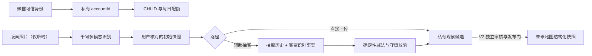

# V1 CloudBase 后端技术设计

> 状态：已批准实施；开发环境资源已建立，仓库当前交付为 13 个私有集合、16 个生成事件函数、`recognize-board` 与 `recognize-draw-tickets` 两个独立模型函数，以及 4 个维护触发器；真实模型与真机验收仍待人工门
>
> 目标环境：`cloud1-d7gxqfwv783a1f131`
>
> 小程序 AppID：`wx4e40b1657ca4563d`

## 1. 设计结论

V1 使用微信云开发的文档数据库、事件云函数和定时触发器。相机照片以二进制短暂进入私有 `recognition-temp/`，事件函数只接收任务绑定 `fileID` 并生成短时 URL 供千问读取；识别完成后立即双端删除，异常孤儿对象由 COS 最短 `1` 天过期删除兜底。长期事实只由“初始结构化版面快照、抽赏事实、最终推导快照”组成。



## 2. 核心边界

- 身份、所有权、配额、特殊号、模型调用和删除只在云函数内处理。
- 客户端不能直接写业务集合。
- 不启用业务图片资产目录；只允许 `recognition-temp/` 临时传输前缀，且不把 base64、临时 URL、文件 ID 或图像哈希当作长期业务字段。
- 云函数日志必须对请求体做白名单记录，禁止打印图片、OpenID、API 密钥和完整位置。
- V1 只生成私有观察候选；V2 公共地图不在本次部署中创建。

## 3. 标识符设计

| 标识符      | 形式                     | 用途                           | 是否公开         |
| ----------- | ------------------------ | ------------------------------ | ---------------- |
| `accountId` | 随机 UUID/同等强度随机值 | 所有权、鉴权、关联、删除、审计 | 否               |
| 微信身份键  | `HMAC(APPID:OPENID)`     | 微信身份到账号的唯一映射       | 否               |
| ICHI ID     | `ICHI-7KQ2M` 或保留短号  | 页面展示、人工查找             | 是               |
| `recordId`  | 随机不可枚举值           | 一次观察的内部主键             | 否               |
| 六位记录码  | 6 位无歧义字母数字       | 客服与人工溯源                 | 可展示，不可鉴权 |
| `boardId`   | 随机内部值               | 同一次辅助抽赏生命周期关联     | 否               |

公开 ID 与内部账号通过 `profiles.accountId` 和 `ichiIds.accountId` 连接。这个连接是普通的一对一/别名关系，不需要把两个 ID 合并成同一个值。

## 4. 数据集合

全部集合默认私有。为避免依赖复合唯一索引，关键幂等关系优先使用确定性 `_id`。

| 集合                    | 主键策略                               | 主要职责                                     |
| ----------------------- | -------------------------------------- | -------------------------------------------- |
| `accounts`              | `_id = accountId`                      | 账号状态、创建/最后访问、删除状态            |
| `wechatIdentities`      | `_id = HMAC(APPID:OPENID)`             | 可信微信身份映射；文档内关联 `accountId`     |
| `profiles`              | `_id = accountId`                      | 规范 ICHI ID、昵称、头像引用和资料状态       |
| `ichiIds`               | `_id = normalizedIchiId`               | `reserved/active/alias/retired` 唯一登记     |
| `accountRoles`          | `_id = accountId:role`                 | `founder/id_admin/contributor/suspended`     |
| `dailyQuotas`           | `_id = accountId:yyyy-mm-dd`           | 当日上限、预占、提交、释放和预占明细         |
| `recognitionJobs`       | `_id = accountId:hash(idempotencyKey)` | 模型任务、版本、状态、结构化原始结果和成本   |
| `observationCandidates` | `_id = recordId`                       | 初始/最终快照、位置、时间、来源、V2 候选状态 |
| `drawSubmissions`       | `_id = recordId:submissionVersion`     | 抽取历史、赏票识别事实、用户修订、差异和推导 |
| `recordCodes`           | `_id = normalizedSixCharCode`          | 六位码唯一登记、recordId 和兼容别名          |
| `deletionJobs`          | 随机任务 ID                            | 记录/账号删除的状态、重试和截止时间          |
| `systemSettings`        | 固定配置键                             | 配额、熔断、模型/提示词/Schema/算法版本      |
| `auditEvents`           | 随机事件 ID                            | 只追加的身份、ID、配额、识别、删除和维护审计 |

不创建 `recognitionEvidenceAssets`，不创建照片业务集合。

### 4.1 必要索引

- `accounts`: `status + updatedAt`。
- `profiles`: `canonicalIchiId`；普通展示查询仍通过注册表解析。
- `ichiIds`: `_id` 唯一；`accountId + state`。
- `dailyQuotas`: `_id` 唯一；`dateKey + updatedAt` 供维护。
- `recognitionJobs`: `_id` 唯一；`accountId + createdAt`、`status + leaseExpiresAt`。
- `observationCandidates`: `ownerAccountId + updatedAt`、`ownerAccountId + status + observedAt`、`v2Eligibility + observedAt`。
- `drawSubmissions`: `ownerAccountId + createdAt`、`recordId + createdAt`。
- `recordCodes`: `_id` 唯一；`recordId`。
- `deletionJobs`: `status + nextAttemptAt`。
- `auditEvents`: `subjectType + subjectId + createdAt`、`actorAccountId + createdAt`。

## 5. 结构化数据契约

### 5.1 `BoardSnapshot`

关键字段：

- `schemaVersion`、`normalizationVersion`；
- `ip.canonicalName/candidates/confidence/evidenceTypes` 与可选 `theme`；
- `pricePerDraw`、`currency`；
- `totalTickets/remainingTickets/attachedTickets`；
- `tiers[]`: `tierId`、`sourceLabels[]`、`prizeName`、`total/attached/remaining`、`confidence`；
- `lastPrize` 和其他机制；
- `issues[]`、`conservationChecks[]`；
- `modelDraft` 与 `confirmedValue` 的字段级差异。

`sourceLabels` 用来保留原版面上的 `D1/D2` 等文字；规范 `tierId` 为 `D`。`SP1`—`SP4` 的规范 `tierId` 分别独立保留。

### 5.2 `ObservationCandidate`

- `recordId/recordCode/boardId/ownerAccountId`；
- `sourcePath`: `assisted-draw` 或 `direct-upload`；
- `initialSnapshot`；
- `finalSnapshot`：直接上传时等于初始快照，辅助抽赏完成后为推导结果；
- `location`: 坐标、精度、授权版本；
- `observedAt/serverReceivedAt/updatedAt`；
- `recognitionJobId/promptVersion/modelVersion/schemaVersion`；
- `consentVersion/disclosureVersion`；
- `status` 与 `v2Eligibility`。

### 5.3 `DrawSubmission`

- `inAppDrawHistory`：小程序已记录抽取；
- `ticketModelDraft`：赏票照片的结构化识别；
- `ticketUserConfirmed`：用户最终确认；
- `reconciliationDiffs`：两种来源的差异；
- `resolvedDrawCountsByTier`；
- `derivationVersion`、`derivationChecks` 和最终状态。

## 6. 云函数边界

| 云函数                       | 职责                                                                                                       |
| ---------------------------- | ---------------------------------------------------------------------------------------------------------- |
| `bootstrap-account`          | 解析可信微信身份，原子建立或恢复账号、资料与公开号                                                         |
| `get-my-profile`             | 返回当前用户可展示资料，不返回 OpenID/internal ID                                                          |
| `bind-wechat-profile`        | 仅接受可信调用者本人明确授权的微信头像和昵称；允许同一所有者后续再次授权更新展示资料，不改变账号或记录归属 |
| `get-quota-status`           | 返回北京时间当日权威配额摘要，不进行预占                                                                   |
| `assign-special-ichi-id`     | 管理员分配保留号并审计                                                                                     |
| `reserve-recognition`        | 原子预占每日 5 次之一并检查全局熔断                                                                        |
| `recognize-board`            | 校验一次性任务令牌并原子抢占，接收临时图片，调用固定模型契约；成功扣次并保存无图片结构化结果，失败立即释放 |
| `get-recognition-job`        | 网络中断后按幂等任务恢复结果，避免二次调用                                                                 |
| `finalize-board-observation` | 只接受已成功扣次任务，提交用户修订，生成六位码并保存初始观察与服务端差异摘要                               |
| `recognize-draw-tickets`     | 同一辅助会话内以独立机器协议临时识别赏票；按 `recordId + submissionVersion` 幂等保存，不额外扣版面配额     |
| `finalize-draw-update`       | 对账、守恒校验并生成最终版面快照                                                                           |
| `get-my-records`             | 只查询调用者本人结构化记录                                                                                 |
| `delete-my-record`           | 启动/恢复本人记录删除                                                                                      |
| `delete-my-account`          | 停用账号并启动关联数据删除                                                                                 |
| `release-stuck-reservations` | 每 5 分钟释放过期预占                                                                                      |
| `reconcile-stuck-jobs`       | 每 10 分钟修复中断任务                                                                                     |
| `retry-deletions`            | 定时重试未完成删除                                                                                         |
| `prepare-v2-backfill`        | 只生成私有资格报告，不创建公共地图数据                                                                     |

千问调用仅在云函数中发生，API 密钥通过 CloudBase 密钥/环境管理注入。

## 7. 两条业务流程

### 7.1 直接上传版面

1. `bootstrap-account`。
2. 客户端请求并取得位置授权。
3. 进入页内实时相机；第一次快门冻结按取景框中心裁切后的照片，第二次对勾确认时检查配额并执行 `reserve-recognition`。
4. 冻结照片临时传给 `recognize-board`；V1 不提供相册输入。
5. 用户核对中文主 IP、可选主题、价格、票数、奖级和地点备注。
6. `finalize-board-observation` 进行 Schema、范围和守恒校验。
7. 保存初始快照，并将它作为当前最终快照；照片立即失去服务端引用。

### 7.2 进入辅助抽赏

前六步与直接上传相同，随后：

1. 小程序围绕同一 `boardId/recordId` 记录抽取历史。
2. 用户结束后拍摄赏票；图片临时传给 `recognize-draw-tickets`，并同时提交截至当时的完整累计抽取计数。
3. 服务端先把 A1/A2 等合并到基础赏级、保留 SP1—SP4，再比较小程序历史和赏票事实。
4. 一致时执行确定性减法并直接写入核对完成版本；不一致时保存 `needs_user_confirmation`，不静默覆盖。
5. 用户留在当前版面继续抽赏后可再次拍摄；新提交沿用同一 `recordId/boardId`，`submissionVersion` 严格递增，同版本重试幂等，旧结果标记 `superseded`。
6. 每次只有最新完成版本可更新 `ObservationCandidate.finalSnapshot`。

## 8. 推导算法

1. 对所有原始奖级标签进行规范化：`D1/D2 → D`，`SP1…SP4` 保持独立。
2. 汇总用户确认的抽中张数。
3. 校验每个奖级存在且抽中数为非负整数。
4. 校验抽中数不超过初始剩余数。
5. 逐级相减并重新求和。
6. 校验“分级剩余合计 = 最终总余票”。
7. 保存输入、输出、校验结果和 `derivationVersion`。

算法失败不修改最后一份已确认快照。重试必须由同一幂等键返回同一结果。

## 9. 权限与安全

- 数据库权限配置为客户端不可直接写；敏感集合客户端不可直接读。
- 每个用户函数先从可信上下文解析身份，再加载内部账号。
- 所有权过滤在服务端强制附加，不接受客户端 owner 条件。
- 管理函数检查服务端角色集合；客户端角色字段一律丢弃。
- API 密钥、HMAC 密钥和管理员引导令牌不进入 Git。
- 六位码和 ICHI ID 均可枚举，因此只用于查找，不产生访问权。
- 模型输出视为不可信输入，必须通过 JSON Schema、归一化、范围、守恒和用户确认。

## 10. 无照片设计的代价与补偿

优点是云存储费用和照片隐私风险显著降低；缺点是后台不能重新查看原图复核模型判断。为此：

- 保留模型原始结构化结果、用户修订、字段差异和全部版本号；
- 记录低置信、冲突和守恒问题，不把它们伪装成已确认事实；
- 无法解释的记录标记为不具备 V2 发布资格，并要求重新拍摄；
- V2 数据污染治理必须依赖多来源一致性、时间、地点、贡献者信誉和异常检测，不能假定有原图审核。

## 11. 删除、维护与可观测性

- 本人记录删除目标 24 小时，账号删除目标 7 天。
- 定时函数负责释放配额、修复卡住任务、重试删除和生成私有 V2 资格报告。
- 监控指标包括：建号成功率、配额预占/释放、模型成功率/耗时/成本、Schema 失败、用户修订率、守恒冲突、删除积压。
- 监控 `recognition-temp/` 遗留对象数量和最老对象年龄；正常应为零，任何超过 `1` 小时的对象都属于清理故障。

## 12. 仓库产物布局

建议在实现阶段建立：

```text
services/cloudbase/
  contracts/            JSON Schema 与共享类型
  functions/            每个事件函数独立入口
  shared/               身份、幂等、配额、审计、归一化、推导
  database/             集合、索引、权限与种子配置
  deploy/               环境清单、部署顺序与验证脚本
docs/delivery/
  v1-cloudbase-backend-guide.md
```

## 13. 批量部署顺序

采用后端优先顺序；CloudBase 开发环境的后端部署不等待前端页面接入：

1. 创建集合与索引。
2. 应用私有权限规则。
3. 写入非秘密系统设置和保留 ICHI ID。
4. 部署账号、资料和特殊号函数。
5. 部署配额、识别、观察、抽赏更新和本人数据函数。
6. 部署维护函数与定时触发器。
7. 独立调用账号、资料、配额、识别任务、观察、本人记录和维护接口，验证权限与幂等。
8. 后端通过后接入小程序：头像只负责一次性授权微信头像／昵称，微信身份仍由云函数可信上下文静默解析；资料页动态展示不可在 ICHI 内修改的昵称、头像和 ICHI ID；识别入口左上角只展示服务端剩余／上限分数环，耗尽时使用单操作异常卡。
9. 用户配置千问 API 密钥。
10. 进行正式 AppID 真机验证与删除/恢复演练。

任一步失败即停止后续步骤；部署脚本必须可重复运行并验证已有资源，不靠手工猜测状态。

## 14. 尚需人工介入的前置条件

- 用户确认本设计和任务拆分。
- 在 CloudBase 安全配置中录入千问 API 密钥。
- 创始人首次真实登录并领取 `ICHI-001`。
- 真机批准微信登录、相机与位置权限。
- 提供/确认一组真实版面与赏票黄金样本及正确答案。
- 在最终部署前确认精确资源变更清单。
- 首次真实小程序调用，用于产生真实 OpenID 映射并完成创始人账号验证；管理端不能伪造该步骤。
